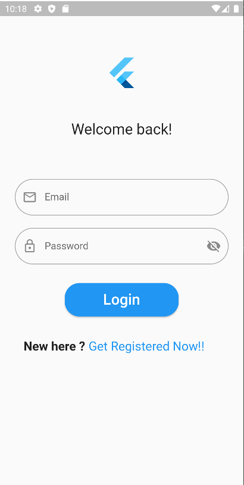
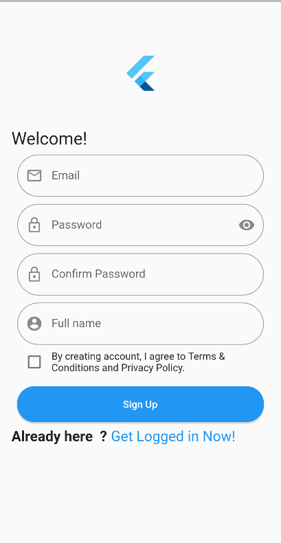
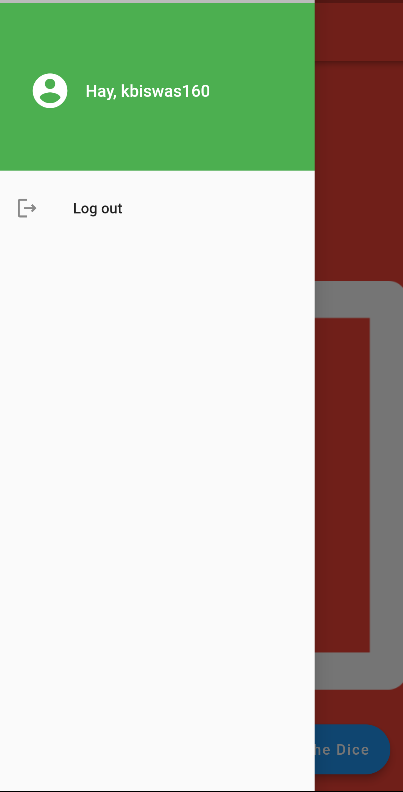
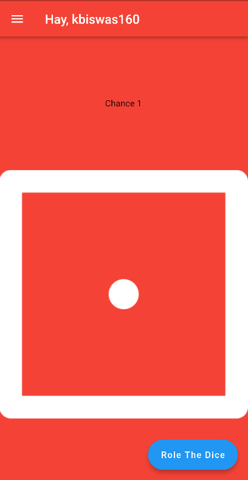
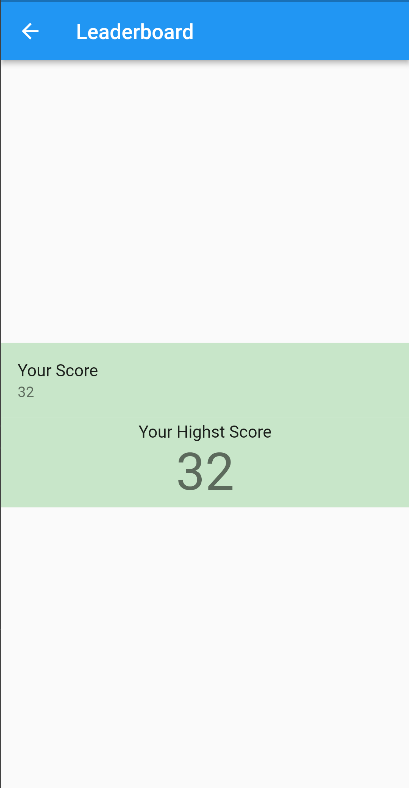

# dice_app_for_interview_bijak

This is flutter Game

## Getting Started

This is a Simple Dice game 

user can login 

## About the Game
User has 10 chance to role the dice 

Geme count the the dices

If user got heghest dices 

it will show a dialog

